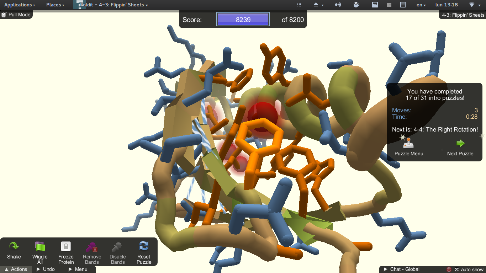
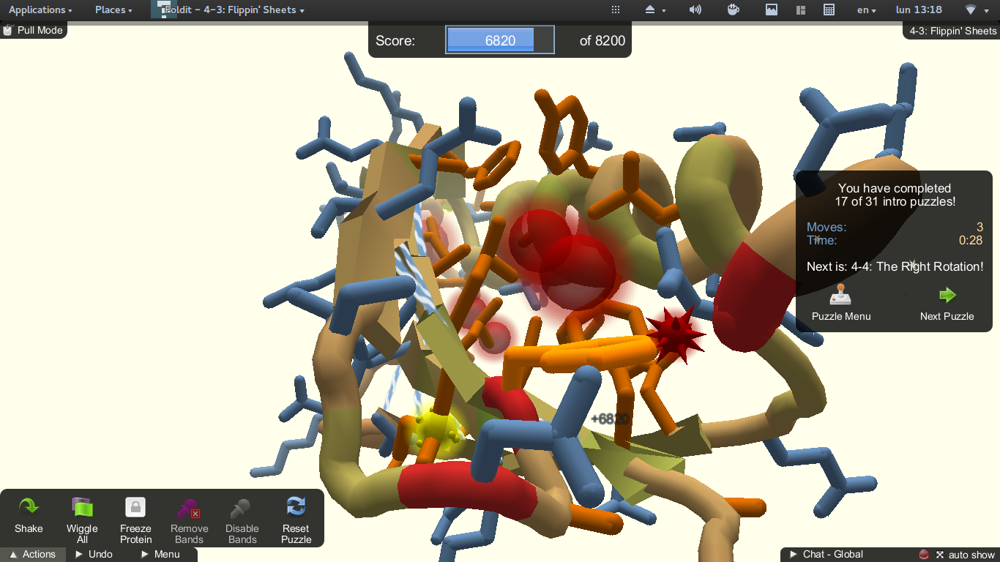
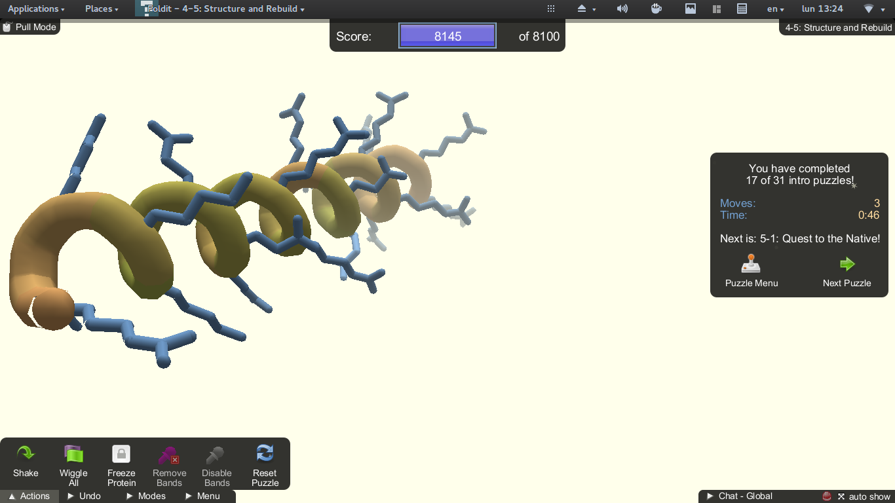
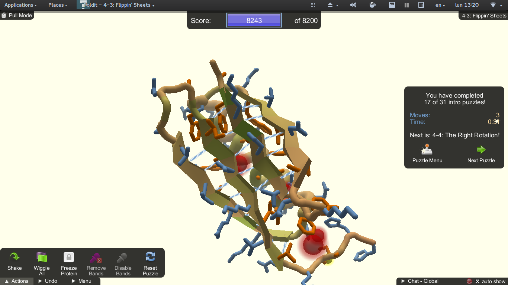
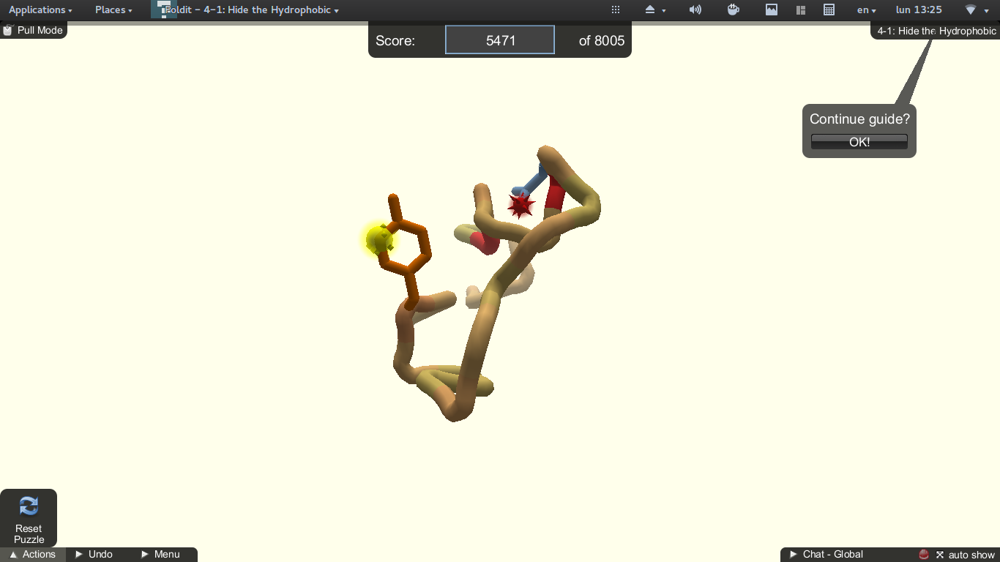
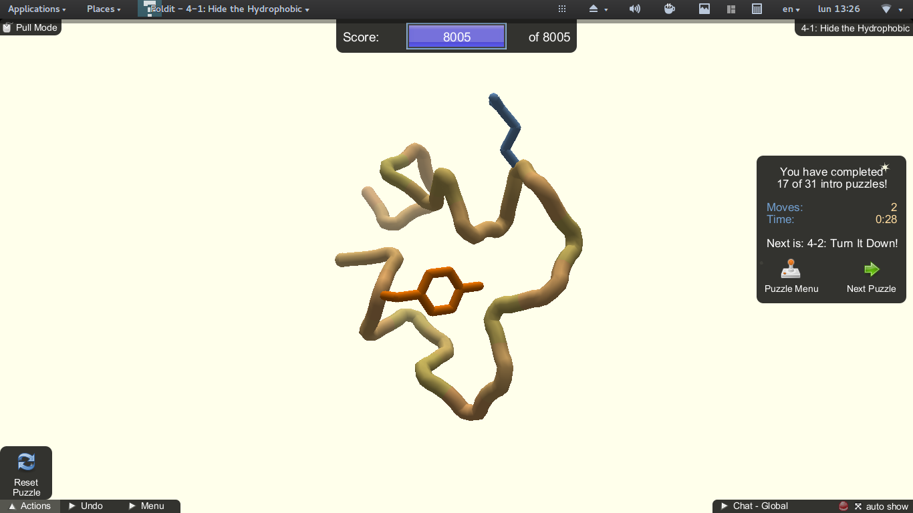
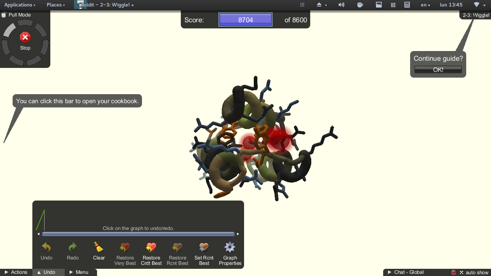
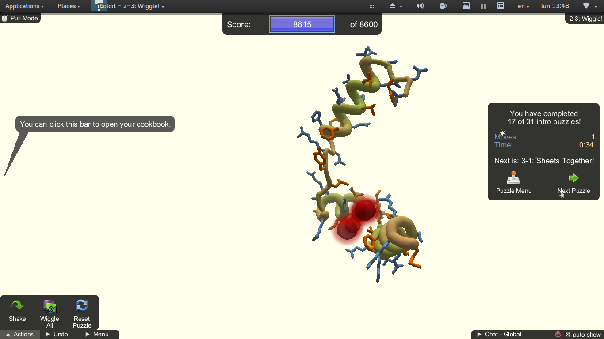

# Práctica 1

  2.1) Ejemplo de aminoácido con cadena lateral aromática
  
  
  
  
  \newpage
  2.2) Ejemplo de aminoácido con cadena lateral chica
  
  
    
  ***
  2.3) Ejemplo de giro en torno a los ángulos phi/psi de un residuo seleccionado, que pasa cuando si sus vecinos tienen cadenas laterales voluminosas?
  
  
  
  
  
  
  
  2.4) Ejemplo de puentes de hidrógeno entre resíduos de una alfa-hélice y entre hojas de una lámina beta. Desde el punto de vista algorítmico, cuál de los estados de estructura secundaria les parece más difícil de programar?  
  
  
  
    
    
  
  
  
  Lass alfa hélices parecen más complejas, porque las láminas beta son relativamente más rectangulares
  y sus polaridades puede asumirse se acomodan.
  
  
  2.5) Ejemplo de residuo hidrofóbico expuesto y luego correctamente "enterrado" tras operaciones con los vecinos.
  
  
  
  
  
  
  
  
  2.6) Ejemplo de conformaciones distintas con puntuaciones similares, para hacer patente el problema de evaluar lo correcto de una conformación.
  
  
  
  
  
  

  2.7) De acuerdo con http://eead-csic-compbio.github.io/bioinformatica_estructural/node17.html calcula el tiempo que llevaría explorar todas las conformaciones posibles de uno de los péptidos o proteínas que utilicen en los puzzles.

